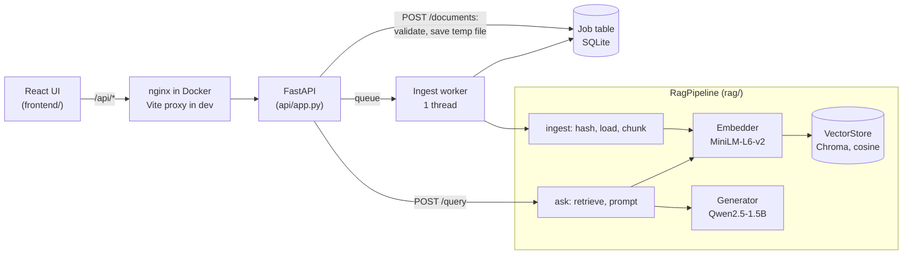

# RAG Document Assistant

[](https://github.com/pavanmanjunath18/rag-doc-assistant/actions/workflows/ci.yml)

A local question-answering service over your own documents. You upload a PDF, text or
Markdown file; it is split into overlapping chunks, embedded with MiniLM and stored in Chroma
by a background job. When you ask a question, the most relevant chunks are retrieved and a
small open model (Qwen2.5-1.5B-Instruct) answers from them, citing each chunk it used.
Everything runs on your machine with no API keys. It started as a Colab notebook over
sections of Netflix's FY2025 10-K. This repo turns that notebook into a tested service with an
API, background ingestion, an evaluation harness and a web UI. On the notebook's 8 benchmark
questions, retrieval raises correct answers from 1 to 6. On 9 new questions it gets 4, and the
evaluation shows that most of its misses are retrieval misses.

## Architecture



The pipeline depends only on three small interfaces (`Embedder`, `VectorStore`,
`Generator` in `rag/interfaces.py`). The real implementations are wired up in
`rag/factory.py`; tests pass fakes; a hosted model or vector database could be swapped in the
same way.

## Quick start

Requires Python 3.11+ (and Node 22+ for the UI). The first run downloads about 3 GB of models.

```bash
python3.11 -m venv .venv && source .venv/bin/activate
pip install -r requirements-dev.txt
cp .env.example .env                       # optional: every setting has a default

# Command line
python cli.py ingest data/corpus/
python cli.py ask "How much debt does Netflix have?"
python cli.py ask "How much debt does Netflix have?" --no-rag      # model only, for comparison

# API + UI
uvicorn --factory api.app:create_app --port 8000
cd frontend && npm install && npm run dev  # http://localhost:5173
```

Or with Docker (CPU only, so answers are much slower; see [D39](docs/decisions.md)):

```bash
docker compose up --build                  # http://localhost:8080 once the API is healthy
```

`data/corpus/` holds the five 10-K sections used throughout. Any `.pdf`, `.txt` or `.md` file
works.

## API

Interactive docs at `http://127.0.0.1:8000/docs` when the server is running.

| Method and path | Request | Response |
|---|---|---|
| `GET /health` | | `200 {"status": "ok", "chunks_indexed": 35}` |
| `POST /documents` | multipart form, field `file` (`.pdf` / `.txt` / `.md`, up to 20 MB) | `202 {"job_id", "filename", "status": "queued"}` and a `Location: /jobs/{job_id}` header |
| `GET /jobs/{job_id}` | | `200` with `status` (`queued`, `running`, `succeeded`, `failed`), timestamps, `error` if it failed, and `result` if it succeeded: `{"document_id", "filename", "chunks", "status": "indexed" \| "replaced" \| "unchanged"}` |
| `POST /query` | JSON `{"question": "...", "top_k": 1-10 (optional), "use_rag": true}` | `200 {"answer": "...", "sources": [{"source", "chunk", "score", "text"}]}`, sources most relevant first |

Errors use FastAPI's `{"detail": ...}` body:

| Code | When |
|---|---|
| 400 | Empty file |
| 404 | Unknown job ID |
| 413 | File over the size limit |
| 415 | Unsupported extension, or the bytes don't match it (for example a `.pdf` that isn't a PDF) |
| 422 | Invalid request body (blank question, `top_k` out of range, unknown field) |

A document that can't be read (a scanned PDF with no text, a corrupt file) produces a
`failed` job whose `error` says why.

## Evaluation

`python -m eval.run_eval` builds a fresh index from `data/corpus/`, asks every question in
[eval/questions.json](eval/questions.json) with and without retrieval, and writes
[eval/results.md](eval/results.md). The proof notebook's recorded answers are re-scored with
the same grader. Qwen2.5-1.5B, float16 on an Apple GPU, greedy decoding, top 3 chunks:

| Question set | No retrieval | RAG | Notebook RAG (re-scored) | Retrieval hit@3 |
|---|---|---|---|---|
| Benchmark: the notebook's 8 questions | 1/8 correct | **6/8 correct** | 5/8 | 6/8 |
| Held-out: 9 questions not used for tuning | 2/9 correct* | **4/9 correct**, 3 declined | - | 5/8 |

\* both are refusals on questions where declining is the right answer.

What these numbers show:
- **Retrieval is what makes the model useful.** Without it, the model invents figures ("about
  $3 billion of debt as of 2021") or refuses. With it, 6 of 8 benchmark answers are correct.
- **Retrieval ranking is now the bottleneck.** All three held-out questions the model declined
  had the answer chunk outside the top 5. The model said so instead of guessing. A larger k
  doesn't fix it (held-out hit@5 = hit@3).
- **The figure-combining guardrail helps but isn't enough.** The notebook's "$17.5B total debt"
  is gone, but a held-out question that explicitly asks for total debt still made the model
  start adding figures.
- **Small sample.** 17 questions on one document: these are directional results, not a
  benchmark. Answers are identical across runs (greedy decoding), so the numbers are
  reproducible.

Details, per-question answers and caveats: [stage 5 notes](docs/stages/stage-5-evaluation.md).

## Design decisions

The full log with alternatives and tradeoffs is [docs/decisions.md](docs/decisions.md)
(D1 to D42). The main ones:

- **Settings from the proof notebook:** 800-character chunks with 150 overlap, top 3,
  MiniLM, Qwen2.5-1.5B, 200 new tokens (D1, D3, D7). Chunk edges snap to whitespace so figures
  like `$45,183,036` are never split (D2).
- **Prompt:** the notebook's soft refusal and synonym hint, plus one guardrail line against
  adding figures together. Its wording was chosen by testing one change at a time after a
  stricter version made the model refuse answerable questions (D4, D5).
- **Greedy decoding** so the same question always gives the same answer, which makes the
  evaluation repeatable (D6).
- **Small interfaces, passed in:** the pipeline receives its embedder, store and generator, so
  171 tests run in under a second with no model, and providers can be swapped (D13, D14).
- **Idempotent ingestion:** document ID = SHA-256 of the file. Identical re-uploads are
  skipped; a changed file with the same name replaces its old chunks, new version first (D22
  to D24).
- **Background jobs** with a SQLite job table and one worker thread: no extra services, job
  history survives restarts, and jobs can't interleave (D26 to D29).
- **Uploads checked in layers:** sanitized filename, extension allowlist, streamed size limit,
  content sniffing, temp file then rename, and an nginx body limit in Docker (D18, D40).
- **Rule-based evaluation with a held-out set,** so every grade traces to a line in a JSON
  file and the prompt isn't only judged on the questions it was tuned on (D31 to D34).
- **Device picked explicitly,** float16 on any GPU, no `device_map="auto"` (D12).

## Failures I hit and how I fixed them

**1. The right chunk was retrieved, but the model said the answer wasn't there.** In my
notebook, "How much debt does Netflix have?" retrieved the paragraph with "$14.5 billion
aggregate principal amount of senior notes", and the model still replied that the context
didn't contain the information. The question said "debt"; the document said "indebtedness"
and "senior notes"; and my prompt told the model to refuse unless the context answered the
question. I softened the refusal to "only if you find nothing relevant at all" and added a
synonym hint ("debt" may appear as "notes", "indebtedness" or "liabilities"). The same failure
came back while building this repo, when I added a stricter guardrail line. Testing one change
at a time showed that the new line was the cause, and I reworded it (D5).

**2. Where the model ran mattered more than I expected.** In the notebook I had to add
explicit checks that the model was on the GPU (`cuda:0`). On my Mac the first version of this
repo loaded the model in float32, about 6.2 GB. With memory already tight,
`device_map="auto"` quietly offloaded part of the model to disk, and in another shell the same
load crashed with a segmentation fault. I now pick the device explicitly (CUDA, then Apple
GPU, then CPU), load in float16 on any GPU (3.1 GB, about 5 s to load), and log the device
at startup. In Docker, which can't use the Mac's GPU, an answer takes about 39 s instead of
about 2 s. I measured it and documented it (D12, D39).

**3. A stale notebook cell showed me the wrong result.** My notebook cells ran out of order,
and one cell displayed the revised prompt in its code with the output of the old prompt under
it. I briefly thought my fix hadn't worked. That's why the evaluation here is a script
(`python -m eval.run_eval`) that runs top to bottom in a fresh process, builds its own index,
and records the git commit it ran on (D33).

**4. The model added up debt figures the document never totals.** Once it stopped refusing,
the notebook's model answered "$14.5 billion + $3 billion = $17.5 billion" of debt. The $3
billion is an undrawn credit facility, and the document never states a total. I added a
guardrail line against adding figures together. On the benchmark question it worked. On a
held-out question that asks for "total debt, including the WBD financing", the model still
started summing, and the first version of my grader marked that answer correct because the
token limit cut it off before the total appeared. I fixed the grader to treat summing language
as wrong and report the result as it is: the guardrail reduces over-synthesis but doesn't
prevent it (D5, D34).

Smaller ones caught by tests while building this repo: error messages that named the upload's
temporary file instead of the user's file (D30), and a Docker setup where values copied into
`.env` could have moved the index off its persistent volume (D41).

## Project layout

```
rag/            core library: loading, chunking, embedding, store, prompts, pipeline, jobs, evaluation
api/            FastAPI app, request/response models, upload checks
frontend/       React + TypeScript UI (Vite), nginx config for Docker
eval/           questions, notebook answers, evaluation script, latest results
tests/          171 tests with fake models (no downloads)
data/corpus/    the five Netflix 10-K sections
docs/           decisions log, proof-notebook summary, notes for each build stage
cli.py          command-line ingest and ask
```

## Development

```bash
pytest                                     # 171 tests, under a second, no models
ruff format --check . && ruff check .
cd frontend && npm run lint && npm run build
```

CI runs all of the above, plus a Docker image build, on every push.

## Limitations

- A small local model: it follows instructions imperfectly (for example it can still add
  figures up when asked for a total), and answers on CPU are slow.
- Pure embedding search misses exact-term questions like "interest expense" in a dense
  financial section. Adding keyword search (BM25) or smaller chunks for that section would be
  the next thing to try, measured with the existing evaluation.
- Single process: one ingestion worker, an in-memory queue, no authentication. Fine for a
  local tool, not for shared use.
- The evaluation set is small (17 questions, one document).

A cloud version (S3 uploads, Step Functions or Lambda for ingestion, Bedrock for generation)
is planned. It would plug in through the same three interfaces; none of it is built yet.
